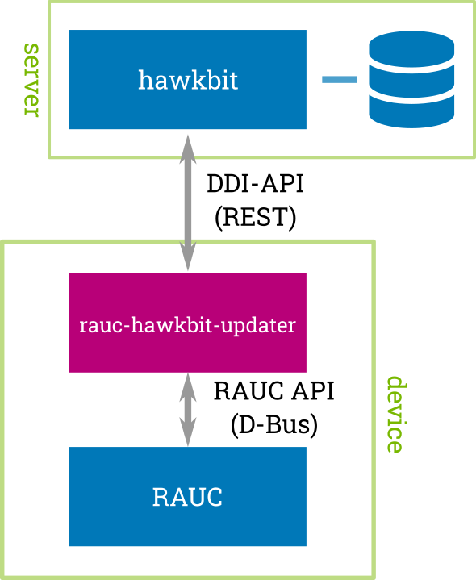

RAUC hawkbit Updater documentation
==================================

Contents:

.. toctree::
   :glob:
   :numbered:
   :maxdepth: 1

   using

   reference
   contributing

   changes

* :ref:`search`
* :ref:`genindex`

The RAUC hawkBit updater is a simple commandline tool / daemon written in C (glib).
The daemon runs on your target and operates as an interface between the
`RAUC D-Bus API <https://github.com/rauc/rauc>`_
and the `hawkBit DDI API <https://github.com/eclipse/hawkbit>`_.

